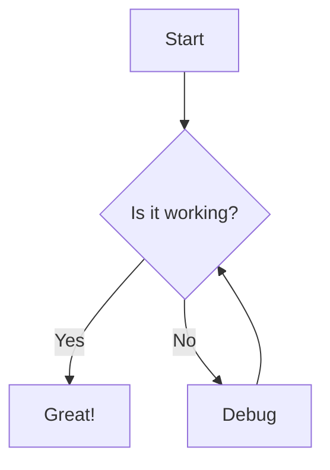
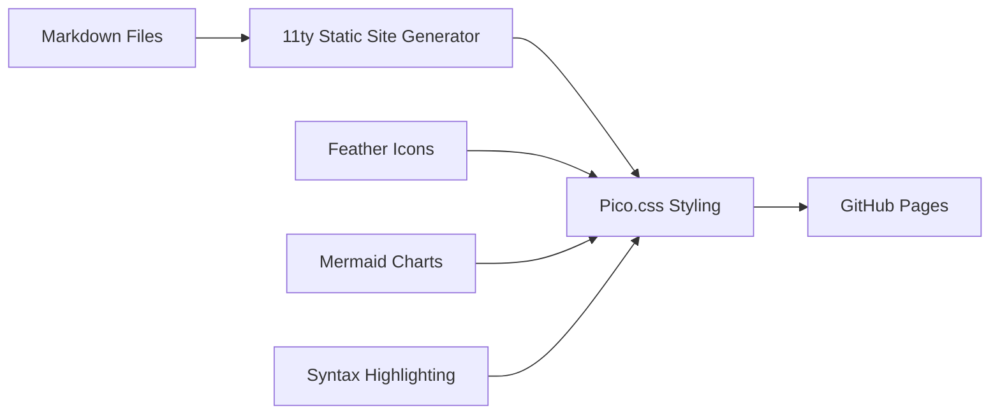

This is a digital garden where I collect thoughts, ideas, and knowledge. Built with 11ty and styled with Pico.css for a clean, minimal experience.

## Features

- **Responsive Design**: Works seamlessly on desktop and mobile
- **Dark/Light Mode**: Toggle between themes
- **Syntax Highlighting**: Code blocks with proper highlighting
- **Mermaid Charts**: Support for diagrams and flowcharts

## Example Code Block

```javascript
function greet(name) {
  return `Hello, ${name}!`;
}

console.log(greet("World"));
```

## Example Mermaid Chart



This is my personal knowledge base and digital garden - a place where ideas grow and evolve over time.

## Philosophy

> "The best way to learn is to teach, and the best way to remember is to write it down."

This space serves as:

- **Learning in Public**: Sharing knowledge as I acquire it
- **Knowledge Management**: Organizing thoughts and insights
- **Creative Expression**: Exploring ideas through writing
- **Community Building**: Connecting with like-minded individuals

## Technical Stack

This site is built with modern, lightweight technologies:



### Key Features

- **11ty**: Fast, flexible static site generator
- **Pico.css**: Minimal, semantic CSS framework
- **Feather Icons**: Beautiful, lightweight icon set
- **Mermaid**: Diagram and flowchart generation
- **Prism.js**: Syntax highlighting for code blocks

## Content Organization

The content is organized into interconnected notes and articles, allowing for:

- Non-linear exploration
- Cross-referencing between topics
- Gradual knowledge building
- Serendipitous discovery

Welcome to my digital garden - feel free to explore and discover!

Let's build something amazing together! Here are the best ways to reach out and connect.

## Social Media

- **GitHub**: [@bhavyasaggi](https://github.com/bhavyasaggi) - Check out my open source projects
- **Twitter**: [@bhavyasaggi](https://twitter.com/bhavyasaggi) - Follow for tech updates and thoughts
- **LinkedIn**: Connect for professional networking

## Contact

- **Email**: [contact@bhavyasaggi.github.io](mailto:contact@bhavyasaggi.github.io)
- **Website**: [bhavyasaggi.github.io](https://bhavyasaggi.github.io)

## Collaboration

I'm always interested in:

- Open source contributions
- Technical writing opportunities
- Speaking at conferences or meetups
- Mentoring and knowledge sharing

Feel free to reach out if you'd like to collaborate on any projects or just want to chat about technology!

Navigate through the pages using the sidebar or the next/previous links at the bottom.
