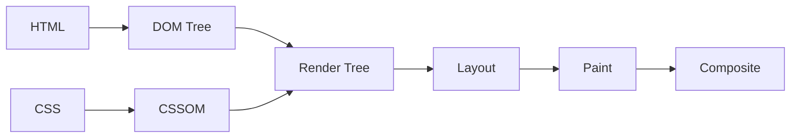

- Use the right (semantic) HTML element for the job eg. headings, lists, etc.\
  Validate HTML markup with <https://validator.w3.org/nu/>.

  - `header-footer-main-nav-aside` can be used for layout.
  - `detail-summary` can be used to mimic an accordion.
  - `progress-meter` can be used to show a progress bar.
  - `em-strong-mark` can be used to indicate importance of text.
  - _MathML_ for mathematical equations.

- Descriptions on elements, eg. `alt` attribute on images, `title` attribute on link tags, and `<label>` tag to form elements. `loading` attribute to defer assets & embeds like images, and iframe.

  ```html
  
  <iframe src="video.html" loading="lazy"></iframe>
  ```

- Using native keyboard accessibility eg. providing `role`, or `tabIndex` attribute. <https://www.w3.org/WAI/ARIA/apg/practices/keyboard-interface/>

- Web is global, so ideally anything on web should easily be adapted for different regions, or languages.

  ```html
  <!DOCTYPE html>
  <!-- Webpage Localization using `lang` attribute. -->
  <html lang="en"></html>
  <!-- Alternate Localized webpages with hreflang attribute -->
  <link hreflang="en" href="https://example.com" rel="alternate" />
  <!-- hreflang should include the link to current language as well! -->
  ```

- Consider UI design fundamentals:

  - _Contrast_:\
    Contrast ratio of 4.5:1 for normal text (less than 18 point or 14 point bold.)\
    Contrast ratio of 3:1 for large text (at least 18 point or 14 point bold.)
  - _Visual Hierarchy_:\
    Headings must not break hierarchical structure.

## How Browsers Work

1. _DNS Lookup_ &rarr; _TCP Connection_ &rarr; _HTTP Request_
2. _HTML Parsing_ &rarr; _DOM Construction_
3. _CSS Parsing_ &rarr; _CSSOM Construction_
4. _Render Tree_ &rarr; _Layout_ &rarr; _Paint_ &rarr; _Composite_



Minimize critical path length by optimizing the order in which critical resources are loaded.

```html
<link rel="preconnect" href="https://fonts.googleapis.com" />
<link rel="dns-prefetch" href="https://api.example.com" />
<link rel="preload" href="critical.css" as="style" />
<link rel="prefetch" href="next-page.html" />
```

## WAI-ARIA

"Web Accessibility Initiative - Accessible Rich Internet Applications" allows a set of additional HTML attributes to provide semantics and accessibility, wherever it is lacking. These are broadly categorized into:

- **Roles** define what an element is or does eg. navigation (`<nav>`), complementary (`<aside>`), banner, search, tablist, tabpanel, button, etc.
- **Properties** give extra meaning or semantics to elements eg. aria-required, aria-label, aria-labelledby, etc.
- **States** define the current conditions of elements eg aria-disabled, etc.`

```html
<!-- Semantic HTML first -->
<button aria-label="Close dialog" aria-expanded="false">
  <span aria-hidden="true">&times;</span>
</button>

<!-- Live regions -->
<div aria-live="polite" id="status"></div>
<div aria-live="assertive" id="errors"></div>

<!-- Landmarks -->
<nav aria-label="Main navigation">
  <main aria-labelledby="main-heading">
    <aside aria-label="Related links"></aside>
  </main>
</nav>
```

## Web Security

- _Click-Jacking_: Set the `SameSite` cookie attribute for session cookies to 'Lax' or 'Strict'.
  - **Use `sandbox` attribute** gives embedded content only the permissions needed. Never add both `allow-scripts` and `allow-same-origin` to sandbox attribute.
  - **Send `X-Frame-Options` header** to prevent other websites from embedding your content.\
    _Read More: <https://blog.mozilla.org/security/2013/12/12/on-the-x-frame-options-security-header/>_
- _Session hijacking_: Use `HTTPS` to reduce chances of content tampering during transit, and to prevent embedded content from accessing parent document, and vice versa.
- _Cross-site scripting (XSS)_: Always Sanitize user input.\
  Content Security Policy (CSP) provides a set of HTTP Headers that allows website administrators to control resources the user agent is allowed to load for a given page.

  ```html
  <meta
    http-equiv="Content-Security-Policy"
    content="default-src 'self'; script-src 'self' 'unsafe-inline'"
  />
  ```

- _Cross-site request forgery (CSRF / XSRF)_: Include CSRF token in requests.

  ```js
  // Include CSRF token in requests
  fetch("/api/data", {
    method: "POST",
    headers: {
      "X-CSRF-Token": document.querySelector('[name="csrf-token"]').content,
    },
    body: JSON.stringify(data),
  });
  ```

### CORS

A bane of all web-devs, a boon to all web-surfers. Read more: <https://jakearchibald.com/2021/cors/>

## Web Data Sharing

- [Cookies](https://developer.mozilla.org/en-US/docs/Web/HTTP/Guides/Cookies): Cookies is data saved by server on browser to support stateful behaviour.
- [SessionStorage](https://developer.mozilla.org/en-US/docs/Web/API/Window/sessionStorage): SessionStorage is saved as keys and values, partitioned by both origin and browser tabs.
- [LocalStorage](https://developer.mozilla.org/en-US/docs/Web/API/Window/localStorage): LocalStorage data is saved as keys and the values in the UTF-16 string format, and has no expiration time.\
  LocalStorage data is specific to the protocol of the document, and is available across browser instances or tabs.
- [IndexedDB](https://developer.mozilla.org/en-US/docs/Web/API/IndexedDB_API): A NoSQL storage system
- Memory:
  - [Blob Url](https://developer.mozilla.org/en-US/docs/Web/URI/Reference/Schemes/blob): Can be generated and must revoked revoked via `createObjectURL` and `revokeObjectURL`.
  - [Data Url](https://developer.mozilla.org/en-US/docs/Web/URI/Reference/Schemes/data): Allows embedding small files inline in documents.

> Browsers can store up to 5 MiB of local storage, and 5 MiB of session storage per origin.

## Web Vitals

Popular metrics measuring many of the various aspects of performance relevant to users:

- **First Contentful Paint** (FCP): measures the time from when the page starts loading to when any part of the page's content is rendered on the screen. (_lab, field_)
- **Largest Contentful Paint** (LCP): measures the time from when the page starts loading to when the largest text block or image element is rendered on the screen. (_lab, field_)
- **First Input Delay** (FID): measures the time from when a user first interacts with your site (when they click a link, tap a button, or use a custom, JavaScript-powered control) to the time when the browser is actually able to respond to that interaction. (_field_)
- **Interaction to Next Paint** (INP): measures the latency of every tap, click, or keyboard interaction made with the page, and—based on the number of interactions—selects the worst interaction latency of the page (or close to the highest) as a single, representative value to describe a page's overall responsiveness. (_lab, field_)
- **Time to Interactiv**e (TTI): measures the time from when the page starts loading to when it's visually rendered, its initial scripts (if any) have loaded, and it's capable of reliably responding to user input quickly. (_lab_)
- **Total Blocking Time** (TBT): measures the total amount of time between FCP and TTI where the main thread was blocked for long enough to prevent input responsiveness. (_lab_)
- **Cumulative Layout Shift** (CLS): measures the cumulative score of all unexpected layout shifts that occur between when the page starts loading and when its lifecycle state changes to hidden. (_lab, field_)
- **Time to First Byte** (TTFB): measures the time it takes for the network to respond to a user request with the first byte of a resource. (_lab, field_)

Each Core Web Vitals metric has associated thresholds, which categorize performance as either "good", "needs improvement", or "poor":

|                           | Good    | Poor    | Percentile |
| ------------------------- | ------- | ------- | ---------- |
| Largest Contentful Paint  | <2500ms | >4000ms | 75         |
| Interaction to Next Paint | <200ms  | >500ms  | 75         |
| Cumulative Layout Shift   | <0.1    | >0.25   | 75         |

## UI Loading Patterns

How and when content is loaded is important. The approaches can broadly classified under

- **Static Import**: Everything is bundled & served together.
- **Dynamic Import**: Bundles are segmented and served only when needed. They are preceeded by placeholders which hydrate later.
  - _Import on visibility_: Bundles are served when they in/near the viewport.
  - _Import on interaction_: Bundle are served on user action, eg. button click to expand a section.
- **Data Loading**:
  - [XMLHttpRequest](https://developer.mozilla.org/en-US/docs/Web/API/XMLHttpRequest): XHR objects are used retrieve data without having to do a full page refresh.
  - [Fetch](https://developer.mozilla.org/en-US/docs/Web/API/Fetch_API/Using_Fetch): Fetch is promise-based modern replacement for XMLHttpRequest.

A few advanced paradigms could be adopted to provided further breakdown on resource timeline.

- **PRPL**
  - _Pushing_ critical resources efficiently to minimize roundtrips to the server.
  - _Rendering_ the initial route soon as possible.
  - _Pre-caching_ assets in the background.
  - _Lazily loading_ routes or assets that aren’t requested as frequently.
- **Islands Architecture**: The static regions of the page are pure non-interactive HTML and do not need hydration. The dynamic regions are a combination of HTML and scripts capable of rehydrating themselves after rendering.
  - Unlike _Progressive Hydration_ where the hydration architecture of the page is top-down, each component has its hydration script in the Islands architecture that executes asynchronously, independent of any other script on the page.

## UI Architecture Patterns

- **MVC** (Model-View-Controller)

  ```mermaid
  flowchart LR
      U[User Input] --> C[Controller]
      C --> M[Model]
      M --> V[View]
      V --> U
  ```

  - **Model**: Data and business logic
  - **View**: UI representation
  - **Controller**: Handles user input

- **MVP** (Model-View-Presenter)

  ```mermaid
  flowchart LR
      U[User Input] --> V[View]
      V <--> P[Presenter]
      P <--> M[Model]
  ```

  - View is passive, Presenter handles all logic
  - Better testability than MVC

- **MVVM** (Model-View-ViewModel)

  ```mermaid
  flowchart LR
    U[User Input] --> V[View]
    V <--> VM[ViewModel]
    VM <--> M[Model]
  ```

  - Data binding between View and ViewModel
  - Popular in WPF, Angular, Vue.js

- **MVI** (Model-View-Intent)

  ```mermaid
  flowchart LR
      I[Intent] --> M[Model]
      M --> V[View]
      V --> I
  ```

  - Unidirectional data flow
  - Reactive programming approach

- **VIPER** (iOS Architecture):\
  Read more: <https://medium.com/@pinarkocak/understanding-viper-pattern-619fa9a0b1f1>
  - _View_: UI components
  - _Interactor_: Business logic
  - _Presenter_: View logic
  - _Entity_: Data models
  - _Router_: Navigation logic

## Browser DevTools Tips

- **Performance Profiling**
  1. _Lighthouse_: Audit performance, accessibility, SEO
  2. _Performance Tab_: Analyze runtime performance
  3. _Network Tab_: Optimize resource loading
  4. _Memory Tab_: Debug memory leaks
- **Debugging Techniques**: Instead of sprinkling `console` statements around, addition of `debugger;` statement adds a programmatic breakpoint.
- **Custom Metrics**: The Web Performance Working Group has also standardized lower-level [APIs](https://web.dev/articles/custom-metrics) that can be useful for implementing your own custom metrics:
  - Performance Observer API
  - User Timing API
  - Long Tasks API
  - Element Timing API
  - Event Timing API
  - Resource Timing API
  - Navigation Timing API
  - Server Timing API

## Must know libraries

- Styling
  - Stylesheet Generators
    - bootstrap (Sass / Scss)
    - tailwind
    - vanilla-extract
  - Styled Components
    - css-modules
- Iconography
  - Sprites
  - SVG
- State Management Libraries
  - Redux
  - Zustand
  - Apollo
- Routing Libraries
  - React-Router
- Component Libraries
  - React-Bootstrap
  - Ant Design
  - MUI
  - Mantine
  - RadixUI
- Functionality Libraries
  - Formik
  - Zod
  - Framer Motion
  - RxJS

## Essential Links

- [MDN Web Peformance](https://developer.mozilla.org/en-US/docs/Web/Performance)
- [WAI-ARIA](https://developer.mozilla.org/en-US/docs/Web/Accessibility/ARIA/ARIA_Techniques)
- [Web Components](https://developer.mozilla.org/en-US/docs/Web/API/Web_components)
- [OWASP Cheat Sheets](https://cheatsheetseries.owasp.org/)
- [Web.dev](https://web.dev/)
- [Can I Use](https://caniuse.com/)
- [Patterns.Dev](https://www.patterns.dev/)
