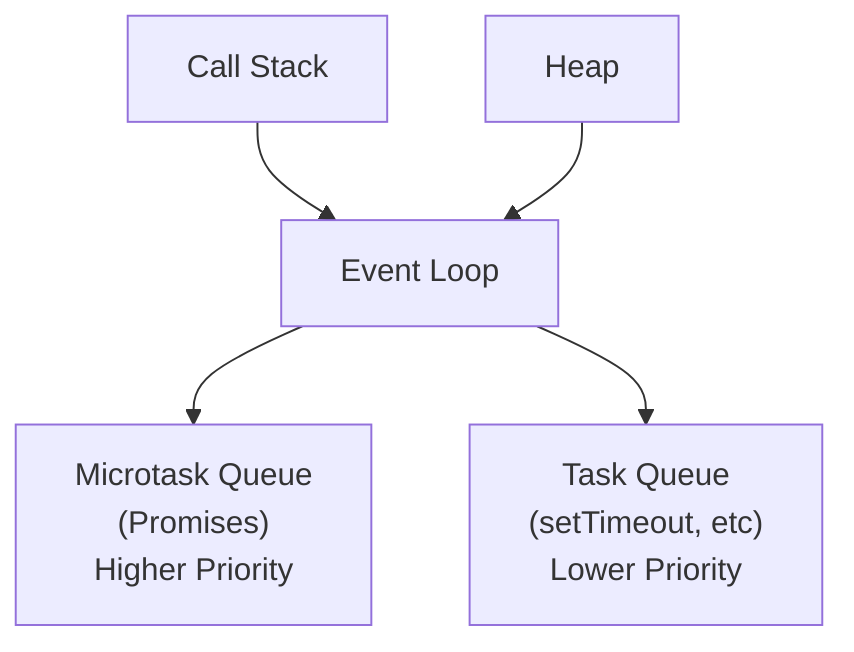

- _Heap_: Memory allocation for objects
- _Call Stack_: LIFO execution of function calls (synchronous code)
- _Microtask Queue_: Promises, queueMicrotask (higher priority)
- _Task Queue_: Callbacks from setTimeout, DOM events



Example:

```js
console.log("Start");

setTimeout(() => console.log("Timeout 1"), 0);
setTimeout(() => console.log("Timeout 2"), 0);

Promise.resolve()
  .then(() => {
    console.log("Promise 1");
    return Promise.resolve();
  })
  .then(() => console.log("Promise 2"));

Promise.resolve().then(() => {
  console.log("Promise 3");
  setTimeout(() => console.log("Timeout 3"), 0);
});

console.log("End");

// Output: Start, End, Promise 1, Promise 3, Promise 2, Timeout 1, Timeout 2, Timeout 3
```

## Microtask vs Macrotask

```js
// Microtasks (higher priority)
Promise.resolve().then(callback);
queueMicrotask(callback);
MutationObserver(callback);

// Macrotasks (lower priority)
setTimeout(callback, 0);
setInterval(callback, delay);
setImmediate(callback); // Node.js
requestAnimationFrame(callback); // Browser
// DOM events
```

## Common Pitfalls

- _Infinite microtask loops_: Promise chains that never end
- _Heavy synchronous operations_: Blocking the main thread
- _Memory leaks_: Uncleaned event listeners and timers

## Resources

- [Event Loop Visualizer](http://latentflip.com/loupe/)
- [MDN Event Loop](https://developer.mozilla.org/en-US/docs/Web/JavaScript/EventLoop)
- [Jake Archibald's Event Loop Talk](https://www.youtube.com/watch?v=cCOL7MC4Pl0)
