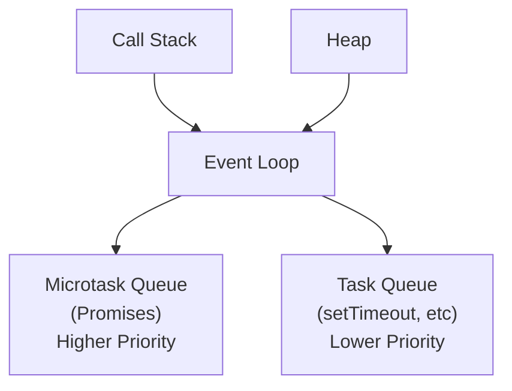

- **Object Methods**: Some Object static methods

  ```js
  // Property descriptors
  Object.defineProperty(obj, "prop", {
    value: 42,
    writable: false,
    enumerable: true,
    configurable: true,
  });

  // Useful methods
  Object.keys(obj); // enumerable own properties
  Object.values(obj); // values of enumerable properties
  Object.entries(obj); // [key, value] pairs
  Object.assign(target, ...sources); // shallow copy
  Object.freeze(obj); // immutable
  Object.seal(obj); // no add/delete properties
  ```

- **Symbols**: Unique identifiers for object properties.

  ```js
  const sym = Symbol("description");
  const obj = { [sym]: "value" };

  // Well-known symbols
  Symbol.iterator; // for...of loops
  Symbol.asyncIterator; // for await...of
  Symbol.toPrimitive; // type conversion
  ```

- **Iterators**: Iterator is an object which defines a sequence and potentially a return value upon its termination.

  ```js
  let result = iter.next();
  while (!result.done) {
    console.log(result.value); // 1 3 5 7 9
    result = iter.next();
  }
  ```

- **Generators**: Generators return a function whose execution is not continuous, and executes until it encounters the yield keyword.

  ```js
  function* makeRangeIterator(start = 0, end = Infinity, step = 1) {
    let iterationCount = 0;
    for (let i = start; i < end; i += step) {
      iterationCount++;
      yield i;
    }
    return iterationCount;
  }
  ```

- **Proxy / Reflect**: Proxy allows you to intercept and customize operations performed on objects (property lookup, assignment, enumeration, function invocation, etc).\
  Reflect provides methods for interceptable JavaScript operations and is used to invoke the corresponding internal method in Proxy handlers.

  ```js
  const proxy = new Proxy(target, {
    get(target, property, receiver) {
      console.log(`Getting ${property}`);
      return Reflect.get(target, property, receiver);
    },

    set(target, property, value, receiver) {
      console.log(`Setting ${property} to ${value}`);
      return Reflect.set(target, property, value, receiver);
    },
  });
  ```

  Operations such as function calls can also be proxied via 'apply' trap.\
  Revocable Proxy creates a revoke function that can be called to disable the proxy.

  Proxies add overhead - use judiciously for performance-critical code. Direct property access is faster than proxied access.

  - _Validation_: Runtime type checking and data validation.
  - _Observation_: Implementing reactive systems
  - _Virtualization_: Creating virtual objects or arrays

## Inheritance / Prototype Chain

JavaScript implements inheritance by using objects. Each object has an internal link to another object called its prototype.

That prototype object has a prototype of its own, and so on until an object is reached with `null` as its prototype. By definition, `null` has no prototype and acts as the final link in this prototype chain.

ES6 introduced `class` keyword but it is mere syntactic sugar atop prototypal mechanism.

```js
// Prototype chain
function Person(name) {
  this.name = name;
}
Person.prototype.greet = function () {
  return `Hi, ${this.name}`;
};

// Class syntax (syntactic sugar)
class Developer extends Person {
  constructor(name, language) {
    super(name);
    this.language = language;
  }

  code() {
    return `Coding in ${this.language}`;
  }
}
```

Some additional methods to for setting prototype chain.

- With `constructor` functions

  ```js
  function Graph() {
    this.vertices = [];
    this.edges = [];
  }

  Graph.prototype.addVertex = function (v) {
    this.vertices.push(v);
  };

  const g = new Graph();
  ```

- With `Object.create()`

  ```js
  const a = { a: 1 }; // a ---> Object.prototype ---> null

  const b = Object.create(a); // b ---> a ---> Object.prototype ---> null
  console.log(b.a); // 1 (inherited)

  const c = Object.create(null); // c ---> null
  console.log(d.hasOwnProperty); // undefined, because d doesn't inherit from Object.prototype
  ```

- With `Object.setPrototypeOf()`

  ```js
  const obj = { a: 1 };
  const anotherObj = { b: 2 };
  Object.setPrototypeOf(obj, anotherObj); // obj ---> anotherObj ---> Object.prototype ---> null
  ```

> Common Pitfalls:
>
> - The prototype chain should be set during creation, as it might cause some engines to recompile code for de-optimization.
> - When iterating over the properties of an object, every enumerable property that is on the prototype chain will be enumerated.

## Event Loop

- _Heap_: Memory allocation for objects
- _Call Stack_: LIFO execution of function calls (synchronous code)
- _Microtask Queue_: Promises, queueMicrotask (higher priority)
- _Task Queue_: Callbacks from setTimeout, DOM events



Example:

```js
console.log("Start");

setTimeout(() => console.log("Timeout 1"), 0);
setTimeout(() => console.log("Timeout 2"), 0);

Promise.resolve()
  .then(() => {
    console.log("Promise 1");
    return Promise.resolve();
  })
  .then(() => console.log("Promise 2"));

Promise.resolve().then(() => {
  console.log("Promise 3");
  setTimeout(() => console.log("Timeout 3"), 0);
});

console.log("End");

// Output: Start, End, Promise 1, Promise 3, Promise 2, Timeout 1, Timeout 2, Timeout 3
```

> Common Pitfalls:
>
> - _Infinite microtask loops_: Promise chains that never end
> - _Heavy synchronous operations_: Blocking the main thread
> - _Memory leaks_: Uncleaned event listeners and timers

### Microtask vs Macrotask

```js
// Microtasks (higher priority)
Promise.resolve().then(callback);
queueMicrotask(callback);
MutationObserver(callback);

// Macrotasks (lower priority)
setTimeout(callback, 0);
setInterval(callback, delay);
setImmediate(callback); // Node.js
requestAnimationFrame(callback); // Browser
// DOM events
```

## Common Patterns

- **Creational**: provide object creation mechanisms.

  - _Singleton_: Single instance
  - _Factory_: Create objects without specifying exact class
  - _Builder_: Construct complex objects step by step
    Eg. Currying to transform multi-argument function into sequence of single-argument functions.

    ```js
    const add = (a) => (b) => a + b;
    const add5 = add(5);
    add5(3); // 8
    ```

- **Structural**: assemble objects and classes into larger structures.
  - _Adapter_: Make incompatible interfaces work together
  - _Decorator_: Add behavior without altering structure
  - _Facade_: Simplified interface to complex subsystem
- **Behavioral**: allows for communication between objects.

  - _Observer_: Notify multiple objects about state changes

    ```js
    class EventEmitter {
      constructor() {
        this.events = {};
      }
      on(event, callback) {
        (this.events[event] ||= []).push(callback);
      }
      emit(event, data) {
        this.events[event]?.forEach((cb) => cb(data));
      }
    }
    ```

  - _Strategy_: Encapsulate algorithms and make them interchangeable
  - _Command_: Encapsulate requests as objects

Additional Patterns

## Bundling Modules

In the beginning, Javascript was written as single file with no export/import/require mechanism and closure based abstraction.

```js
const Module = (function () {
  let private = 0;
  return {
    increment: () => ++private,
    getCount: () => private,
  };
})();
```

Eventually modularity was introduced to organize and structure the code better. Some of which are:

- **ESM** (ES Modules)

  Introduced in ES6, ESM is a static module structure, meaning you can statically analyze the imports and exports without running the code.\
  It is Tree-shakeable, and allows bundlers like Rollup to remove unnecessary code.

  ```js
  // Named exports
  export const PI = 3.14159;
  export function calculateArea(radius) {
    return PI * radius * radius;
  }
  // Dynamic imports
  const { PI, calculateArea } = await import("./math.js");
  ```

- **CJS** (CommonJS)

  CJS imports module synchronously, and provides a copy of the imported object. Primarily used for Backend (NodeJS) environments.

  ```js
  // Exports
  module.exports = {
    PI: 3.14159,
    calculateArea: function (radius) {
      return this.PI * radius * radius;
    },
  };
  // Imports
  const { PI, calculateArea } = require("./math");
  ```

- **AMD** (Asynchronous Module Definition)

  AMD imports modules asynchronously. Primarily used in Frontend (Browser) environments.

  ```js
  // Define module
  define(["jquery", "underscore"], function ($, _) {
    return {
      doSomething: function () {
        // Use $ and _ here
      },
    };
  });
  // Require module
  require(["myModule"], function (myModule) {
    myModule.doSomething();
  });
  ```

- **UMD** (Universal Module Definition)

  UMD is more like a pattern to configure several module systems, and is used as a fallback module when using bundler like Rollup.

  ```js
  (function (root, factory) {
    if (typeof define === "function" && define.amd) {
      // AMD
      define(["jquery"], factory);
    } else if (typeof module === "object" && module.exports) {
      // CommonJS
      module.exports = factory(require("jquery"));
    } else {
      // Browser globals
      root.MyLibrary = factory(root.jQuery);
    }
  })(typeof self !== "undefined" ? self : this, function ($) {
    return {
      doSomething: function () {
        // Library code
      },
    };
  });
  ```

> Popular Build tools: **Webpack**, **Vite**, **Rollup**, **Parcel**

## Bundle Performance

- _Dynamic Imports_

  ```js
  // Route-based splitting
  const Home = lazy(() => import("./pages/Home"));
  const About = lazy(() => import("./pages/About"));

  // Feature-based splitting
  const loadChart = async () => {
    const { Chart } = await import("./components/Chart");
    return Chart;
  };
  ```

- _Webpack Magic Comments_

  ```js
  const LazyComponent = lazy(() =>
    import(/* webpackChunkName: "lazy-component" */ "./LazyComponent")
  );

  const PreloadedComponent = lazy(() =>
    import(/* webpackPreload: true */ "./PreloadedComponent")
  );
  ```

- _ES Modules for Tree Shaking_

  ```js
  // utils.js - Export individual functions
  export function add(a, b) {
    return a + b;
  }
  export function subtract(a, b) {
    return a - b;
  }

  // main.js - Import only what you need
  import { add } from "./utils.js"; // subtract won't be bundled
  ```

## Essential Links

- [MDN JavaScript Reference](https://developer.mozilla.org/en-US/docs/Web/JavaScript/Reference)
- [You Don't Know JS](https://github.com/getify/You-Dont-Know-JS)
- [ECMAScript Proposals](https://github.com/tc39/proposals)
- [Event Loop Visualizer](http://latentflip.com/loupe/)
- [Jake Archibald's Event Loop Talk](https://www.youtube.com/watch?v=cCOL7MC4Pl0)
- [MDN JavaScript modules](https://developer.mozilla.org/en-US/docs/Web/JavaScript/Guide/Modules)
